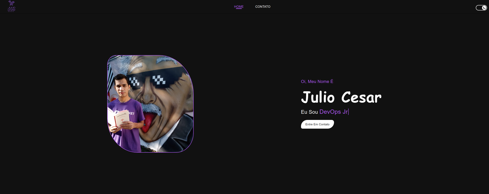

# Landing Page

Esta é uma página de destino simples construída com HTML, CSS e JavaScript para demonstrar várias funcionalidades. A página inclui uma barra de navegação responsiva, um trocador de texto automático e funcionalidade de troca de tema.

## Recursos

### Barra de Navegação

A barra de navegação inclui links de navegação para as seções "Home" e "Contato". Há também um botão de alternância de tema para mudar o tema do site entre os modos claro e escuro. Em dispositivos móveis, há um menu estilo "hamburguer" para facilitar a navegação.

### Seção Hero

A seção hero mostra uma imagem de fundo, seu nome e um trocador de texto automático que exibe diferentes títulos de trabalho.

### Trocador de Texto Automático

O trocador de texto automático no código JavaScript muda dinamicamente o título de trabalho na página de destino. Ele alterna entre três títulos diferentes: "Analista De Suporte", "Estudante de Redes de Computadores" e "DevOps Jr". O texto muda a cada 20 segundos.

### Mudança de Tema

O site oferece funcionalidade de mudança de tema com o botão de alternância de tema. Isso permite aos usuários alternar entre temas claro e escuro. O logotipo e o ícone do tema mudam de acordo com a escolha.

